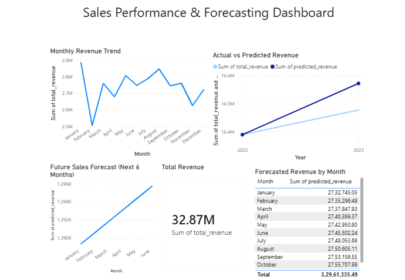

# 📊 Predictive Sales Intelligence Dashboard

---

## 📌 Problem Statement
In real-world companies, sales data is often scattered across systems and underutilized. 
Business teams struggle to understand revenue trends, measure the effectiveness of discounts, 
and accurately forecast future sales. This project addresses the need for a data-driven 
approach to analyze historical sales performance and predict future revenue to support 
better business decisions.

---

## 📊 Dataset
- **Rows:** ~10,000+ sales records  
- **Columns:** Order ID, Order Date, Product Category, Price, Discount %, Quantity Sold, 
  Customer Region, Rating, Revenue, etc.  
- **Source:** Public retail sales dataset (Superstore-style dataset)  
- **Time Range:** Multiple months of historical sales data  

---

## 🛠 Tools Used
- **Python:** Pandas, NumPy, Matplotlib  
- **Machine Learning:** Scikit-learn (Linear Regression for forecasting)  
- **Data Visualization:** Power BI  
- **Version Control:** Git & GitHub  

---

## 📈 Key Analysis Performed
- Data cleaning and preprocessing of raw sales data  
- Exploratory Data Analysis (EDA) to identify revenue patterns and trends  
- Analysis of discount impact on total revenue  
- Customer rating vs average revenue analysis  
- Time-series aggregation of monthly sales  
- Machine learning–based sales forecasting  
- Interactive dashboard creation in Power BI  

---

## 🔍 Insights Generated
- Revenue shows a consistent trend over time with identifiable growth periods.  
- Higher discount percentages do **not** consistently lead to higher revenue, indicating 
  that excessive discounting can reduce profitability.  
- Products with higher customer ratings generate higher average revenue, highlighting 
  the importance of customer satisfaction.  
- The forecasting model successfully captures the overall revenue trend and provides 
  reasonable future sales estimates.

---

## 📷 Screenshots

### 🔹 Power BI Dashboard Overview

### 🔹 Sales Forecast Analysis

### 🔹 Revenue Performance Insights

---

## 🚀 Business Impact
- Enables business teams to monitor sales performance and revenue trends in real time  
- Supports data-driven discount and pricing strategies  
- Helps management anticipate future sales and plan inventory, marketing, and staffing  
- Demonstrates how machine learning can be used to convert historical data into 
  actionable business insights  

---
